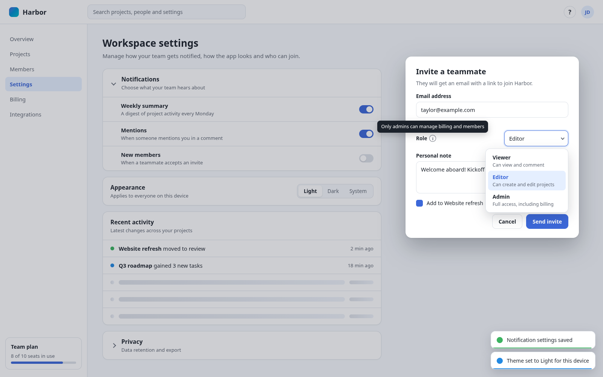

# ui-primitives

[](https://www.npmjs.com/package/@cplieger/ui-primitives) [](https://jsr.io/@cplieger/ui-primitives) [](https://github.com/cplieger/ui-primitives/issues?q=label%3Astryker-tracker)

ui-primitives adds accessible toasts, tooltips, popovers, dialogs and focus handling to a TypeScript web app without a component framework. Your own CSS decides how they look.



It replaces the timers, focus handling, ARIA attributes and dismiss logic you would otherwise write around `<dialog>`, live regions and positioned panels. It ships as ESM-only TypeScript source and has one runtime dependency, [`@cplieger/reactive`](https://github.com/cplieger/reactive). It needs TypeScript 6 or later and a bundler that compiles TypeScript source. It is licensed under Apache-2.0.

## Why use it

ui-primitives is built for apps that draw their interface with plain DOM code and keep their own look.

- Its 14 primitives ship behavior, the ARIA wiring each pattern needs and the elements they create. None ships colors, borders, radii, fonts or shadows.
- You style it with ordinary CSS, through `--uip-*` custom properties and rules for the `.uip-*` classes.
- `ask()` replaces `window.confirm` and `window.prompt` with a dialog you can style and `await`.
- Toasts and screen-reader announcements keep working while a modal `<dialog>` is open, because the library moves them inside it.
- Importing a module touches no DOM. A bundler can drop every primitive you do not import.
- Animations respect `prefers-reduced-motion`.

Consider [Radix Primitives](https://www.radix-ui.com/primitives/docs/overview/introduction) if you build in React. Its unstyled components follow the WAI-ARIA patterns and handle focus and keyboard navigation. Consider [Floating UI](https://floating-ui.com/docs/getting-started) if you need only to anchor a floating element to its trigger, in any framework or none.

## Install

```sh
npm i @cplieger/ui-primitives
npx jsr add @cplieger/ui-primitives
```

## Usage

Load the base stylesheet once, then call the primitives you need:

```ts
import { toast } from "@cplieger/ui-primitives/toast";
import { ask } from "@cplieger/ui-primitives/ask";
import { initTooltips } from "@cplieger/ui-primitives/tooltip";
import { createTheme } from "@cplieger/ui-primitives/theme";
import "@cplieger/ui-primitives/css";

initTooltips();
const theme = createTheme({ storageKey: "app-theme" });

toast.success("Saved");

if (await ask("Delete this file?", { variant: "destructive" })) {
  // ...
}
```

Then give the primitives your app's look with your own rules:

```css
:root {
  --uip-toast-duration: 5000ms;
}
.uip-toast {
  background: #1e1e1e;
  color: #fff;
  border-radius: 8px;
  padding: 0.75rem 1rem;
}
.uip-toast-progress {
  --uip-toast-progress-color: #4ade80;
}
```

The `/css` import works on npm. JSR exports only modules, so a JSR install has no `/css` export. Load the stylesheet from the package file `css/ui-primitives.css` instead.

Because the package is TypeScript source, your compiler checks it and `@cplieger/reactive` with your own `tsconfig` flags. `@cplieger/reactive` installs with it automatically.

## API

Import each primitive from its own subpath, `@cplieger/ui-primitives/<name>`, or everything from `@cplieger/ui-primitives`.

- Notifications: [toast](docs/toast.md) shows stacked, queued, auto-dismissing messages. [announce](docs/announce.md) speaks a message to screen readers.
- Floating panels: [tooltip](docs/tooltip.md) shows tips from a `data-uip-tooltip` attribute. [popover](docs/popover.md) positions a panel next to an element or a screen point, for menus and pickers. [popup](docs/popup.md) opens and dismisses a panel your CSS positions.
- Dialogs: [dialog](docs/dialog.md) adds behavior to a `<dialog>` you already have. [modal](docs/modal.md) builds one from your content. [ask](docs/ask.md) asks a yes-or-no or text question as a promise.
- Focus and keyboard: [focus-trap](docs/focus-trap.md) keeps Tab inside a container. [roving-focus](docs/roving-focus.md) moves focus through a menu or toolbar with the arrow keys. [disclosure](docs/disclosure.md) animates a show-and-hide region.
- Page state: [theme](docs/theme.md) stores a light, dark or system theme and applies it before the first paint. [view-transition](docs/view-transition.md) queues `document.startViewTransition` calls. [skeleton](docs/skeleton.md) times a loading placeholder so it does not flicker.

The generated reference is on [JSR](https://jsr.io/@cplieger/ui-primitives/doc).

## CSS contract

The base stylesheet sets only layout and motion. You supply the rest in two ways:

1. Define `--uip-*` custom properties for anything the base stylesheet reads, such as durations, offsets, z-indices and the backdrop dim. Set them in `:root` or on a narrower selector.
2. Write your own rules against the `.uip-*` classes for background, color, border, radius, padding and type.

Everything the library owns is namespaced, so it never collides with your app's names:

- classes: `uip-*`, such as `.uip-toast` and `.uip-tooltip`
- custom properties: `--uip-*`, such as `--uip-toast-duration`
- trigger attributes: `data-uip-*`, such as `data-uip-tooltip`
- state classes: `is-*` on a library element, such as `.uip-toast.is-entering`, `.is-shown` and `.is-leaving`

Each primitive's reference page lists its own classes, state classes and custom properties. One token is shared. `--uip-backdrop` sets the dialog and ask backdrop dim, defaults to `oklch(0% 0 0deg / 50%)`, and is the default for `--uip-modal-backdrop`.

Every motion property is a duration and easing pair. The `--uip-*-easing` timing functions default to `ease`, except the toast progress bar, which defaults to `linear`. You override them the same way as the durations.

Stacking in the page follows a fixed order. `--uip-z-popover` (`1100`) sits below `--uip-z-toast` (`9999`) and `--uip-z-tooltip` (`10000`). A modal `<dialog>` opens in the browser's top layer, above every `z-index`.

Under `prefers-reduced-motion: reduce`, the base stylesheet cuts animations to 0.01ms rather than zero. `transitionend` and `animationend` still fire, so close animations complete.

## Contributing

Issues and pull requests are welcome. See [CONTRIBUTING.md](CONTRIBUTING.md) for the conventions and how to run the checks locally.

## Disclaimer

This project is built with care and follows security best practices, but it is intended for personal / self-hosted use. No guarantees of fitness for production environments. Use at your own risk.

This project was built with AI-assisted tooling using [Claude](https://claude.com), [GPT](https://openai.com), and [Kiro](https://kiro.dev). The human maintainer defines architecture, supervises implementation, and makes all final decisions.

## License

Apache-2.0. See [LICENSE](LICENSE).
